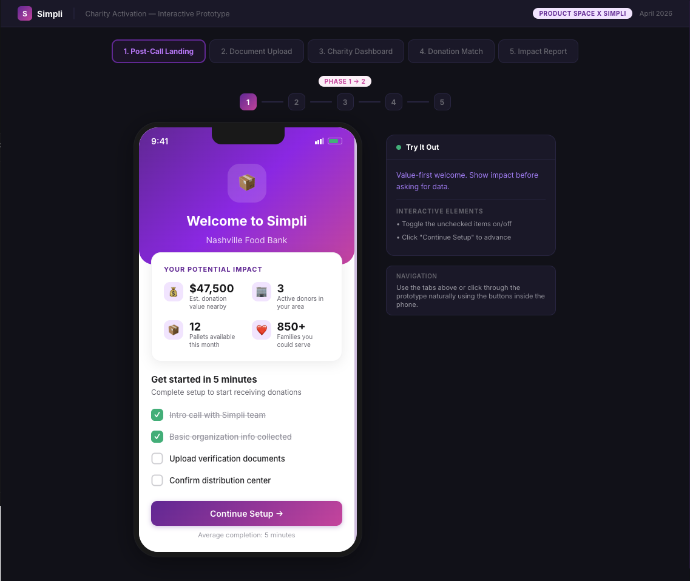
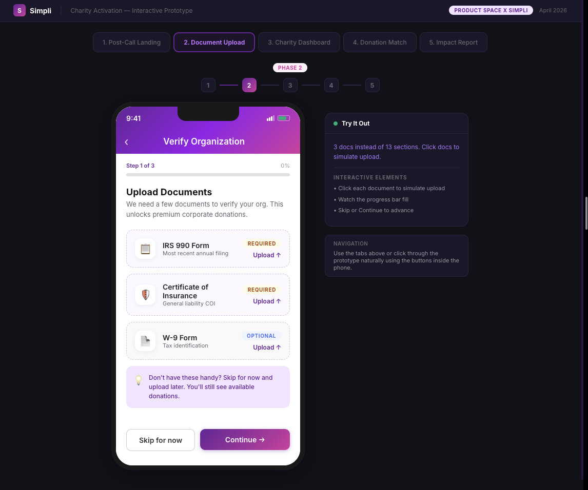
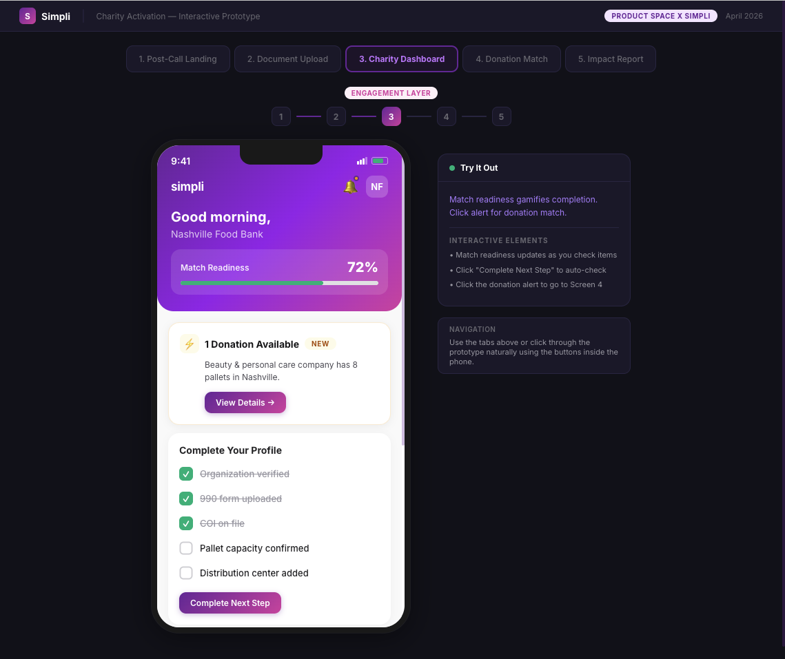
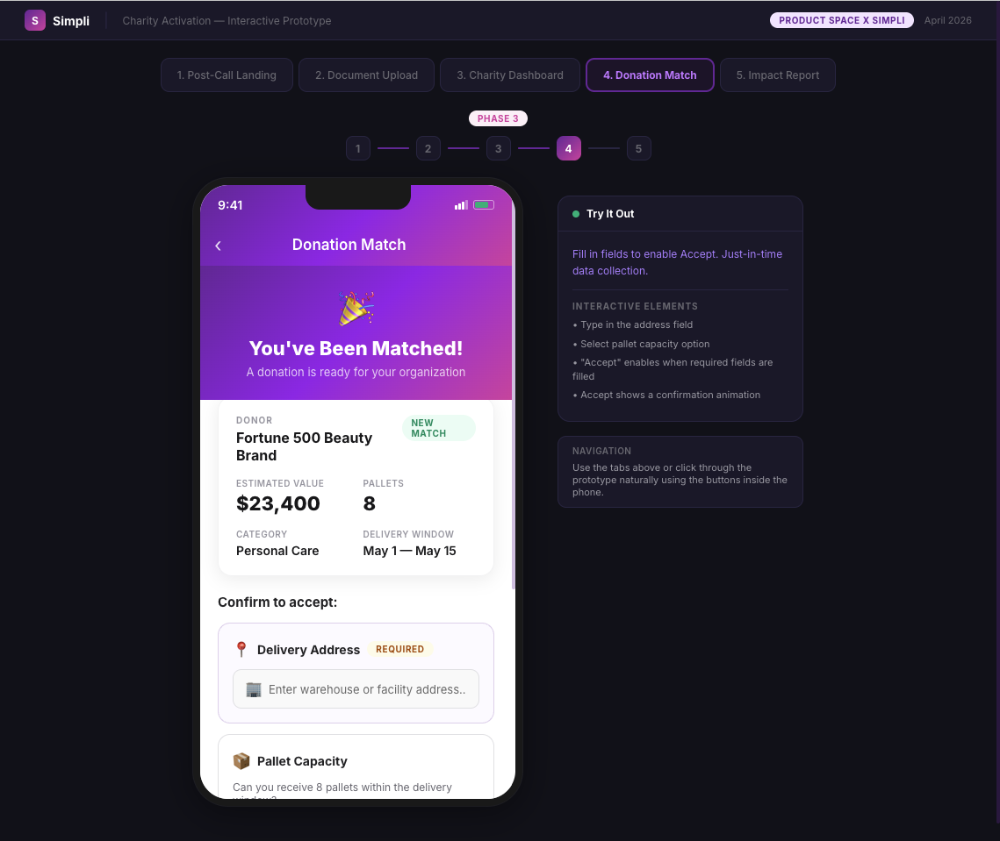
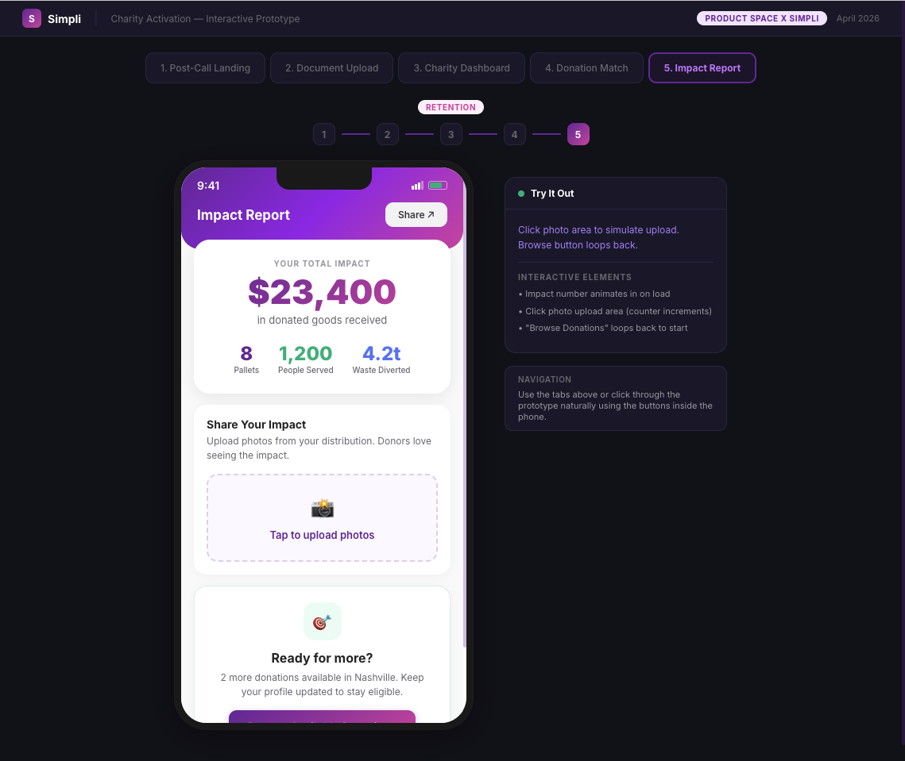

# Simpli Nonprofit

Product repository for the Simpli charity activation layer. Eight week Product Space x Simpli project, April 2026. This README is the full case study. Each section links to the underlying artifact so the thinking is one click away from the conclusion.

## The short version

Simpli helps large corporations donate excess inventory to charities. It has facilitated roughly $70M in donations and is targeting $150M plus this year. The constraint is the charity side. A production audit of all 198 charities on the platform surfaced a three layered gap: 55 percent never finish onboarding, 77 percent have never received a donation, and the onboarded base must roughly double to meet projected corporate supply. This project designed an activation layer that wraps Simpli's onboarding. It leads with value before asking for data, turns a thirteen section profile into a legible match readiness arc, and collapses the donation match moment into a frictionless just in time flow.

## 1. Context

Simpli is a full stack platform for corporate inventory donation. It handles vetting, logistics, and impact reporting. Cargill, L'Oreal, Glow Recipe, Cardinal Health, and Smashbox run donation pilots through it. Simpli also owns SearchCharities.org, a charity directory with detailed profiles built on IRS filing data.

The brief was open ended: design and prototype a charity facing feature that plugs into the existing platform, with the understanding that Simpli's engineering team would build the production version if the pitch was strong. Elliott Cho led the project. The PM team was Anikait Rawat and Vyom Mishra. Simpli was represented by Tommy (CEO and product) and Joseph Oliver (engineer rebuilding the onboarding flow).

The full context is in [`docs/01-project-overview.md`](docs/01-project-overview.md).

## 2. Discovery

Three discovery streams ran in parallel.

| Stream | Source | What it produced |
|--------|--------|------------------|
| Secondary research | Industry reports (Momentive 2025, Sage 2025), nonprofit technology writing, four full text reads of r/nonprofit threads | [`research/secondary-research-brief.md`](research/secondary-research-brief.md) |
| Prod vs dev audit | app.simpli.supply vs dev.simpli.supply | [`research/prod-vs-dev-audit-apr12.md`](research/prod-vs-dev-audit-apr12.md). Established that dev data was inflated test data; production is the only reliable source. |
| Full production audit | All 198 charities on app.simpli.supply | [`research/production-audit-apr20.md`](research/production-audit-apr20.md). The funnel data, the three layered gap, the onboarding data model. |

The synthesized insights are in [`docs/03-discovery-insights.md`](docs/03-discovery-insights.md). Four points carried the work forward:

1. Charities are not short on tools. They are short on attention. Any feature requiring a new login faces deep adoption resistance.
2. Onboarding completion is Simpli's biggest leak, and the leak is in the experience, not the data model.
3. Onboarding completion does not equal activation. There is a second drop off after the form.
4. The supply demand math forces a doubling. Activation speed is as important as activation count.

## 3. Problem

The problem statement is in [`docs/02-problem-statement.md`](docs/02-problem-statement.md). In short:

- **Layer 1, onboarding drop off:** 109 of 198 charities (55 percent) received an invitation and never completed onboarding. The intake form is thirteen sections of profile data with no value signaling.
- **Layer 2, activation drop off:** Across the full base, only 45 of 198 charities (22.7 percent) have ever received a donation. Even among Onboarded charities, roughly half have never been matched. Profile completeness is poor even among active charities; Midwest Food Bank, an Onboarded food bank that has received donations, had an empty Pallet Capacity field.
- **Layer 3, supply demand mismatch:** Six active pilots represent more than $4.57M in known value and 297 plus pallets. The current onboarded base of 89 charities cannot absorb that supply at the cadence Simpli's $150M target requires.

The three archetypes the team designed for are in [`docs/05-personas.md`](docs/05-personas.md): a high capacity food bank, a mid sized service charity (the modal Simpli charity), and a small or volunteer run charity.

## 4. Strategy

The product direction shifted three times across the eight weeks. The full record is in [`docs/04-decision-log.md`](docs/04-decision-log.md). The shape of the decisions:

| Date | Move | Why |
|------|------|-----|
| April 1 | PRD v0.1 framed three directions: Smart Notifications, Profile Health Score, Donation Intake Tracker | Initial framing from secondary research |
| April 7 | Pivoted away from notifications | Dev audit revealed Joseph was already building SMS flows. Duplicating engineering work was the wrong move. |
| April 12 | Pivoted from a standalone microsite to an activation layer | SearchCharities.org already had charity profiles. Building on top was stronger than building alongside. |
| April 12 | Deprioritized volunteer management | Crowded category. A thin Simpli competitor in a saturated space would dilute focus. |
| April 20 | Audit correction reframed the problem to the three layered gap | The earlier "all charities closed" headline was a misread of an operating hours field. |
| April 20 | Scope locked to activation and retention | Joseph owned onboarding simplification. The PM team owned the engagement experience that wraps it. |

The v0.1 PRD that framed the original three directions is preserved at [`archive/prd-v0.1.docx`](archive/prd-v0.1.docx).

## 5. Solution

The activation layer is a five screen sequence that maps onto the three phase onboarding rebuild Joseph was already building (intro call, simplified on platform step, donation match). The full design rationale is in [`docs/06-design-rationale.md`](docs/06-design-rationale.md).

| Screen | Funnel job | |
|--------|------------|---|
| 1. Post call landing | Convert the 55 percent who never complete onboarding by leading with concrete local match data, not a generic invitation email |  |
| 2. Document upload | Keep verification short and value framed, not another thirteen section form |  |
| 3. Charity dashboard | Attack the 77 percent activation drop off with a match readiness score and live match availability |  |
| 4. Donation match | Collapse the match moment into a few just in time fields (warehouse, pallet capacity, contact) instead of upfront |  |
| 5. Impact report | Close the loop with a shareable impact summary that turns each activated charity into a retention and referral surface |  |

The interactive version is in [`prototype/`](prototype/) (React, Vite). To run it:

```
cd prototype
npm install
npm run dev
```

The Charity Activation Layer PRD as delivered is at [`docs/PRD.docx`](docs/PRD.docx). The presentation deck delivered to Simpli leadership is at [`docs/activation-layer-deck.pdf`](docs/activation-layer-deck.pdf).

## 6. Outcomes and what should happen next

The activation layer is scoped to engagement and retention. The metrics it should move, with baselines from the April 20 audit, are in [`docs/07-success-metrics.md`](docs/07-success-metrics.md):

- Onboarding completion rate from 45 percent toward 70 percent.
- Activation rate within the Onboarded cohort from about 50 percent toward 75 percent.
- Pallets absorbed per active charity per month, with a target of 1.5 to 2 to clear projected corporate supply.

The recommended phasing if Simpli takes the work to production is in [`docs/08-roadmap.md`](docs/08-roadmap.md): convert the Invited bucket first (Screens 1 and 2), then activate the Onboarded base (Screens 3 and 4), then close the loop (Screen 5). Volunteer management, profile auto population, and partial pallet matching are real opportunities surfaced during discovery but deliberately out of scope for this project.

## How to navigate this repo

| Folder | What is in it |
|--------|---------------|
| [`docs/`](docs/) | The product narrative, in reading order (`01-project-overview.md` through `08-roadmap.md`), plus the PRD and the deck |
| [`research/`](research/) | The evidence base: secondary research brief and the two platform audits |
| [`prototype/`](prototype/) | The interactive prototype, a React and Vite app covering the five screen activation flow |
| [`design/`](design/) | The interim microsite blueprint that preceded the activation layer direction |
| [`archive/`](archive/) | Superseded iterations and the v0.1 PRD, kept for history |

## Status

Discovery and PRD complete. Prototype built and mapped onto Simpli's three phase onboarding rebuild. Presented to Simpli leadership in April 2026.

## Team

Elliott Cho, project lead. PM team: Anikait Rawat, Vyom Mishra. Simpli stakeholders: Tommy (CEO and product), Joseph Oliver (engineer).
